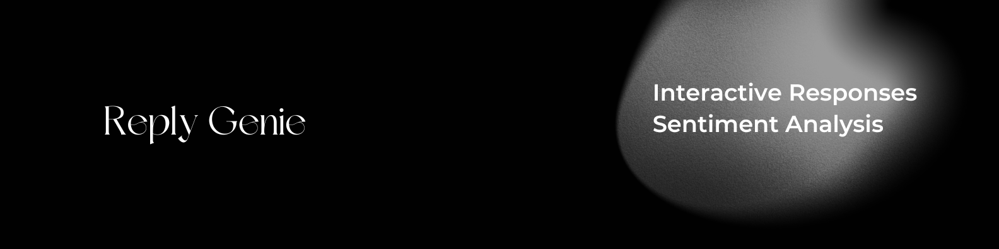

# ReplyGenie

ReplyGenie is an AI-powered Twitter sentiment analysis and interaction bot built using Python and MindsDB. It leverages machine learning models to analyze the sentiment of tweets in real-time and generates appropriate responses based on the sentiment detected.

## Features

- **Sentiment Analysis**: Automatically analyzes the sentiment (positive, negative, neutral) of tweets.
- **Interactive Responses**: Generates personalized responses to tweets based on the sentiment analysis.
- **Real-time Monitoring**: Continuously monitors Twitter for new tweets and responds dynamically.
- **User-friendly Interface**: Simple setup and configuration using Python and MindsDB.
- **Scalable**: Can be extended to handle multiple Twitter accounts and custom responses.

## Installation

